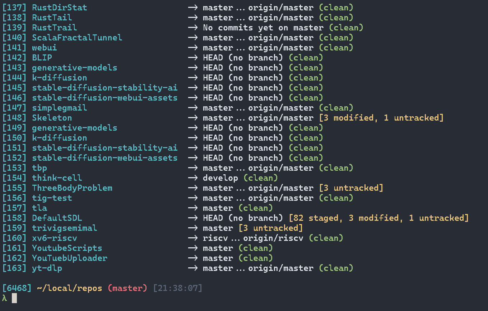

# Git Repo Scanner

A high-performance C++20 utility designed to recursively scan directory trees, discover Git repositories, and provide quick status reports or path lookups[cite: 1].

## Demo



## Features

* **Recursive Scanning**: Efficiently traverses directory structures while automatically skipping heavy or irrelevant subdirectories (`build`, `build_deps`, `vcpkg`, `node_modules`, `.vs`, `.gradle`)[cite: 1].
* **Intelligent Short Summary (`-s`)**: Programmatically queries repository states using porcelain formats to output a clean, colored, single-line overview of the current branch, staged changes, modifications, and untracked files[cite: 1].
* **Indexed Lookups**: Pass a repository index to output its absolute path directly, making it ideal for shell scripting and automation workflows[cite: 1].
* **Robust & Safe**: Features safe path conversions for multi-byte code pages on Windows and RAII-based color management via `rang`[cite: 1].

## Requirements

* A C++20 compatible compiler supporting `<filesystem>` and `<print>`[cite: 1]
* [rang](https://github.com/agauniyal/rang) terminal styling library[cite: 1]
* Git CLI available in your system `PATH`

## Usage

```bash
# 1. Scan and display detailed status for all discovered repositories
repo-scanner <parent-folder-path>

# 2. Display an intelligent, single-line summary for all repositories (-s)
repo-scanner <parent-folder-path> -s

# 3. Retrieve the absolute path of a specific repository by its index
repo-scanner <parent-folder-path> <repo-index>
